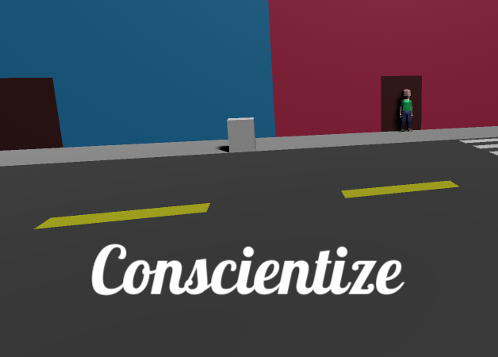
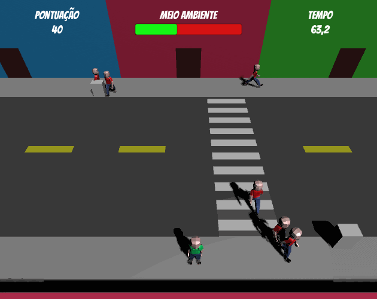

  

  Conscientize people to save the Environment.
   
   
  <a href="https://guibdbello.itch.io/conscientize">Play Game</a>
  ·
  <a href="https://github.com/GuiBDBello/Conscientize/issues/new?labels=bug&template=bug-report---.md">Report Bug</a>
  ·
  <a href="https://github.com/GuiBDBello/Conscientize/issues/new?labels=enhancement&template=feature-request---.md">Request Feature</a>

## Table of Contents

<ol>
  <li><a href="#introduction">Introduction</a></li>
  <li><a href="#getting-started">Getting Started</a></li>
  <li><a href="#build-process">Build Process</a></li>
  <li><a href="#acknowledgments">Acknowledgments</a></li>
  <li><a href="#license">License</a></li>
</ol>

## Introduction

Save the environment by raising the awareness of citizens from a quiet, colorful street.

  

### How to Play

When you see a civilian throwing trash in the street, get closer and click on him with your **Left Mouse Button** to start a conversation, then click on the trash he has thrown away to aware him to pick it up and toss it in the trash bin.

Controls:
- **WASD**: Move.
- **Left Mouse Button**: Select a civilian to talk to or a trash to aware to pick up.

### Game Jam

This game was made for the game jam [Step Up Your Dev Jam](https://itch.io/jam/step-up-your-dev-jam), which took place between May 18th and May 27th of 2020.

Theme: **Ajudar** (English: **To aid**).

(<a href="#readme-top">back to top</a>)

## Getting Started

To get a local copy up and running follow the steps below.

### Prerequisites

1. [Unity](https://unity.com/download)

### Configuration

1. Clone repository: `git clone https://github.com/GuiBDBello/Conscientize.git`.
1. Add the project to Unity or Unity Hub: `ADD > Select the folder you just cloned`.
1. Open project.

(<a href="#readme-top">back to top</a>)

## Build Process

1. With your project opened in Unity, select `File > Build Settings...`.
1. Select the `Platform` that you wish to build for (you may have to install a build module if you don't have it already installed).
1. Select `Build` or `Build And Run`.

(<a href="#readme-top">back to top</a>)

## Acknowledgments

List of references that were useful in the making of this project:

* [Unity Learn](https://learn.unity.com/)
* [Brackeys](https://www.youtube.com/channel/UCYbK_tjZ2OrIZFBvU6CCMiA)

### Assets

| Name | Type | Creator | Source |
| --- | --- | --- | --- |
| Bangers | Font | [Vernom Adams](https://fonts.google.com/?query=Vernon+Adams) | [Google Fonts](https://fonts.google.com/specimen/Bangers) |
| Lobster | Font | [Impallary Type](https://fonts.google.com/?query=Impallari+Type) | [Google Fonts](https://fonts.google.com/specimen/Lobster) |

(<a href="#readme-top">back to top</a>)

## License

Distributed under the MIT License. See [LICENSE](./LICENSE) for more information.

(<a href="#readme-top">back to top</a>)

